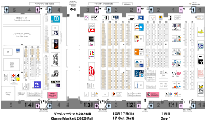
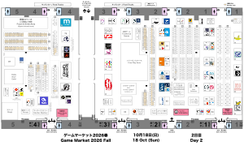

# Game Market Venue Maps

These are based on the official ゲームマーケット maps (which can be found [here](https://gamemarket.jp/map)), but differ as follows:

* Bilingual Japanese-English
* Company logos are included for large booths.
  * These can help make it easier to navigate during the event since the large booths tend to have more visible signage.
* Single-day (Saturday-only or Sunday-only) booths are marked in yellow

Latest maps are for 2026 Autumn:

| Saturday | Sunday|
| :---: | :---: |
|  |  |
| 17 Oct 2026 | 18 Oct 2026|
