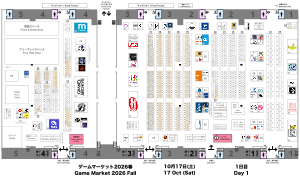
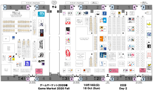
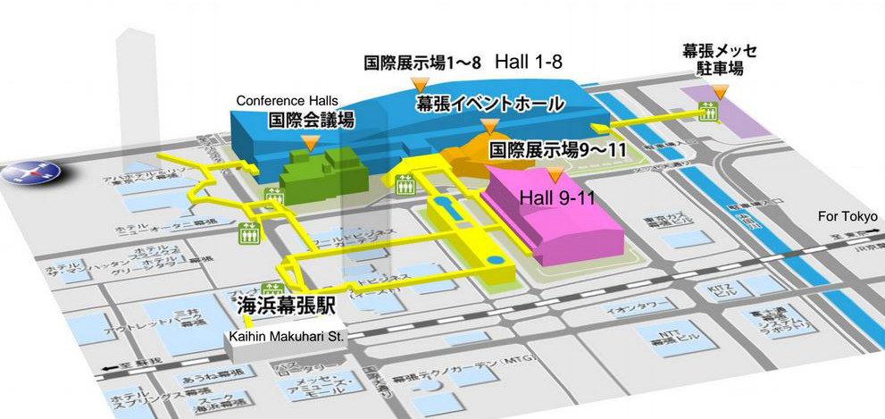
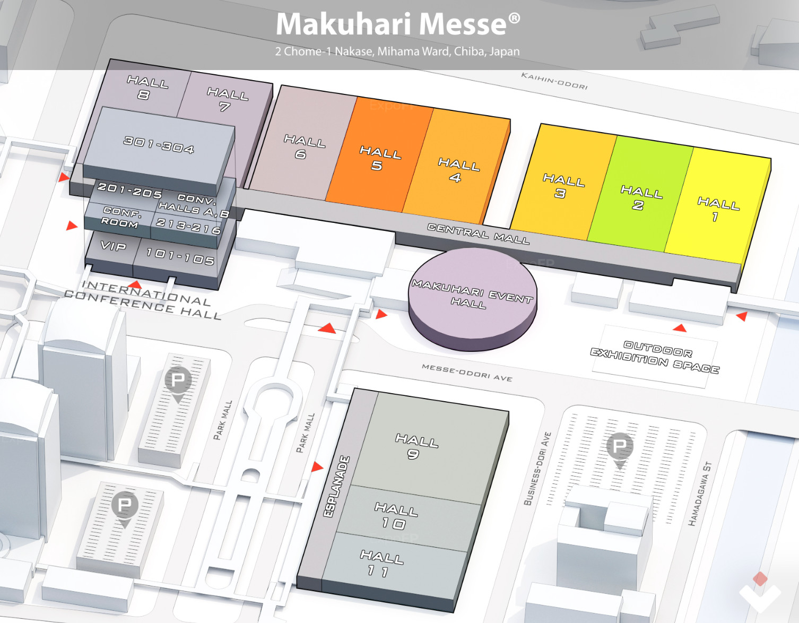

# Game Market Venue Maps

These are based on the official ゲームマーケット maps (which can be found [here](https://gamemarket.jp/map)), but differ as follows:

* Bilingual Japanese-English (日本語 / 英語)
* Company logos are included for large booths. (企業ロゴ)
  * These can help make it easier to navigate during the event since the large booths tend to have more visible signage.
* Single-day (Saturday-only or Sunday-only) booths are marked in yellow (土曜日のみ、日曜日のみは黄色で)

Latest maps are for 2026 Autumn:

| Saturday | Sunday|
| :---: | :---: |
|  |  |
| 17 Oct 2026 | 18 Oct 2026|

## Getting to Makuhari Messe

[Google Maps link](https://www.google.com/maps/place/Makuhari+Messe/@35.6478328,140.0338906,18.15z/data=!3m1!5s0x602281f5cd7bb0e9:0x5abe79654716ea10!4m10!1m2!2m1!1sMakuhari+Messe!3m6!1s0x6022821fd52ebfdf:0xcec0c09c4bed45e0!8m2!3d35.6476856!4d140.0355286!15sCg5NYWt1aGFyaSBNZXNzZVoQIg5tYWt1aGFyaSBtZXNzZZIBC2V2ZW50X3ZlbnVlmgEjQ2haRFNVaE5NRzluUzBWSlEwRm5TVVJhYkZCMU4wVjNFQUXgAQD6AQQIABBK!16zL20vMDYxdmI0!5m1!1e1?entry=ttu&g_ep=EgoyMDI2MDkyNy4xIKXMDSoASAFQAw%3D%3D)

When you arrive in the area (probably at Kaihimmakuhari Station, unless your hotel is in the area), you'll follow the elevated walkways (in yellow) to go to the International Exhibition Hall 1-8 (in blue).

You can ignore the Conference Halls (in Green), the Event Hall (in Orange) and the separate building for Halls 9-11 (in Pink-ish), but they're useful for reference.

The main entrance to the Messe is the Central Entrance, which (on the map above) is where the yellow walkways take you between the green and orange buildings up to the blue building.

Here's another view highlighting the 5 halls that are used by Game Market.

The Central Entrance brings you to the Central Mall in front of Hall 5. You'll go down the mall to the right and there will be people directing you to the entrance for Game Market.